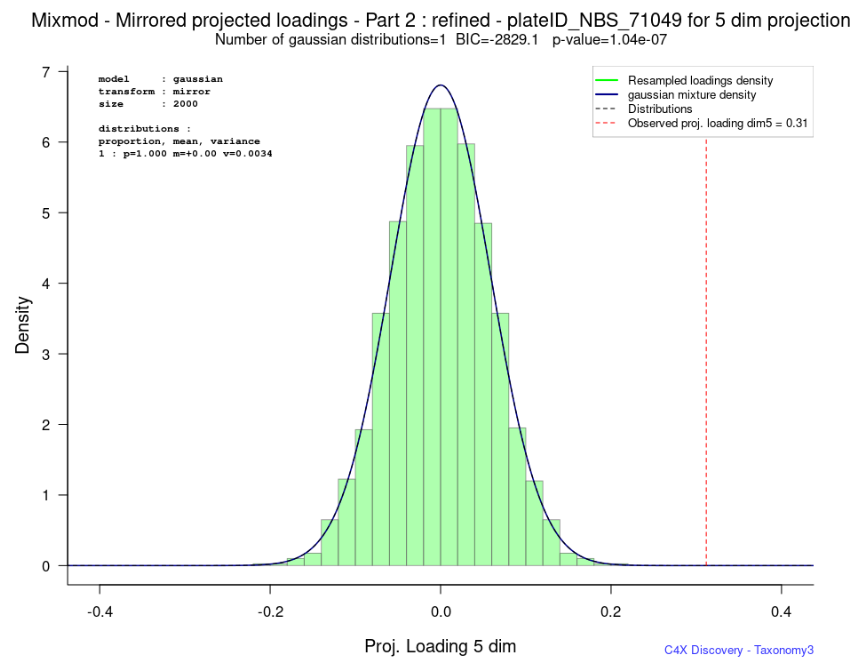

# Tax3 Mixmod Algorithm

These algorithms were developped in 2010, with the Modal team (https://www.inria.fr/en/modal) and their Mixmod tool :
- https://showroom.saclay.inria.fr/asset/mixmod/
- also an R package since 2015 : https://hal.archives-ouvertes.fr/hal-00919486

They perform p-value parametric assessments based on resampled PCA loadings.

This assessment is based on Mixture Models[^1] using the Expectation Maximisation (EM) algorithm[^2] applied typically to _Gaussian_ Mixture Models (GMM)[^3] .

## Objectives

Any signal, such as the distribution of resampled loadings of a variable of interest (in green below), can be modeled with a mixture (blue line) of Gaussian distributions (dotted black lines). This allows to assess the significance of this variable : its p-value is calculated from the area of the mixture distribution right of the observed loading (dotted red line) :

&nbsp;&nbsp;&nbsp;&nbsp;&nbsp;&nbsp;&nbsp;&nbsp;
<a href="./picts/ex1_distribution.png" target="_blank"></a>

The number of distributions in the mixture, their weights, their parameters (mean, variance) and how they 'fit' with the distribution matter. Each blue square below represent different models, with large differences in p-values potentially overlapping the statistical significance threshold (typically around 10⁻⁸). In this example, the model with the best 'fit' (ie lowest BIC) gives a non-significant pvalue, whereas many other models give significant p-values. 

Therefore, for each variable, the parametric space has to be explorer throughly. When thousands of variables have to be assessed that way, this becomes non trivial and potentially costly: how the variables spaces are explored has to be based on informed decision. The objective of the 2010 project was to build an algorithm to lower the cost of these spaces explorations whilst producing robust assessment of p-values.

&nbsp;&nbsp;&nbsp;&nbsp;&nbsp;&nbsp;&nbsp;&nbsp;
<a href="./picts/ex1_distribution_pvalues.png" target="_blank"></a>

## Basics of the parametric space exploration algorithm

### BIC

The Bayesian Information Criterion (BIC[^4]) is used to select the best mixture model that has the best fit with the data. The lowest BIC is the best one. 

Typically, when the number of distributions increases, BIC will decrease, wobble around several local mimima and increase. The objective of the algorithm is to find the lowest BIC and not be stuck in one of the local minima.

Exploring a large number of distributions is computationaly intensive, so 2 stopping criteria were implemented. The analysis will stop if BIC is raising several times or is several times above its last lowest value. The default values of these parameters (4 and 8) is based on past experience, but may change with more complex projects.

```ini
EXPLORATION_RAISED_LIMIT=4
EXPLORATION_HIGHER_LIMIT=8   # introduced after the 2010 work, required in more complex projects
```

&nbsp;&nbsp;&nbsp;&nbsp;&nbsp;&nbsp;&nbsp;&nbsp;
<a href="./picts/bic_exploration.png" target="_blank"></a>

### CHAINS

For a specific number of Gaussian distributions, the algorithm can try several `chains`. A chain represent an exploration of the parametric space&nbsp;: each chain has a starting point, mixture parameters will evolve while the space is explored by the EM algorithm. 

#### Number of chains

Typically, running too many chains does not add value. An appropriate number of chains is the number of distributions. This is the 'adaptive' chain mode.

```ini
CHAIN_MODE=adaptive  # number_of_chains set to number of Gaussian distributions
N_CHAINS=20          # maximum number of chains
```

Here, the number of chain is fixed to a specific value: 50 is very thourough in our experience.

```ini
CHAIN_MODE=fixed
N_CHAINS=50
```

#### Chains stopping criteria

The exploration will stop after a user defined number of iterations, or if the EM fitting criteria is met. Default values are&nbsp;:

```ini
# precision used to decide that the model is a good fit
EM_EPSILON=0.0001

# number of iterations before stopping the convergence process
EM_NBITERATION=200
```

#### Chains starting point

The starting point of a chain matters. Several options can be used. The default is to :
- do a small, quick, EM 'pre-run' 50% of the time, on a data sample, in order to increase likelihood of the chain convergence
- use random starting points 50% of the time, to reduce biases that may be introduced by a pre-run.


```ini
#
# DO_PRE_RUN : yes, no, alt (default)
#   - no  : no pre-run
#   - yes : prerun with a small sample of the dataset to generate starting values
#   - alt : do preruns 50% of the time as prerun with small sample set may bias results (default)
DO_PRE_RUN=alt

#
# PRERUN_INIT :
#   - SMALL_EM  : a quicker EM algorithm that does not favor local minima and can bias results
#   - RANDOM (default)
PRE_RUN_INIT_TYPE=RANDOM

# RunInitType ( if no PreRun or PreRun fails) :
#  - SMALL_EM : is the default here to increase likelihood of convergence
#  - RANDOM
RUN_INIT_TYPE=SMALL_EM
```

#### Manage failures

Sometimes, for a given number of distributions, chains do not converge. This option allows to restart the chains a few times&nbsp;:

```ini
#
# Number of re-tries with a model that fails
EM_ERROR=5
```

### STEPS

Our experience with gene level analyses is that distributions of aggregated loadings are more complex, requiring mixture models with a larger number of Gaussians. In order to prevent spending too much time on mixtures with a small number of distributions, the following 2 steps algorithm was implemented&nbsp;:

- step1 : quickly reach the area where BIC wobbles around local minima
- step2 : thourough assessment of this area going in both directions (more distributions and less distributions)

Each step takes the BIC and Chain options described above :

```ini

# QUICK STEP 1
STEP1_CHAIN_MODE=fixed            # only one chain
STEP1_N_CHAINS=1
STEP1_EXPLORATION_RAISED_LIMIT=1  # stop very quickly
STEP1_EXPLORATION_HIGHER_LIMIT=1

# THOROUGH STEP 2
ENABLE_STEP2=yes                   # run step 2
STEP2_CHAIN_MODE=adaptive          
STEP2_N_CHAINS=10
STEP2_EXPLORATION_RAISED_LIMIT=4
STEP2_EXPLORATION_HIGHER_LIMIT=8

```

## Beta mixture

Since loadings in correlation PCA are between -1 and +1, using a Gaussian mixture may not be appropriate. This was investigated in the 2010 project. 

A mixture of Beta distribution can be used, but it was not optimized and is very slow. The recommendation is to use a mixture of Gaussians and check for any large excess of the mixture outside the -1 +1 interval. This is done by the analysis script and reported as `pvalue_excess_over1`.

```ini
# Mixture model, either:
#  - gaussian   : this will make use of the mixmod library (fast, coded in C, optimized)
#  - beta       : this will make use of a tax3 specific R library (slow, coded in R, not optimized)
#
MODEL=beta
```

## The interest of mirroring loadings

In the EM option file, you can transform the data in several ways :

```ini
# TRANSFORM
#  - none      : no data transform
#  - mirror    : duplicate data with opposite values
#  - fold      : take absolute values (to be used with mixtures of beta distributions)
TRANSFORM=mirror
```

Mirroring data makes sense for several reasons, and is recommended, based on past experience and the 2010 collaboration :

- In PCAs, the sign of loadings is not defined. The tax3 algorithm forces the case/control status to be positive, simply to have consistency and good looking plots.

- It will require more distributions to model data that is not mirrored, since its symmetry pattern (ie sign not defined) can be lost. So, it would take more time for the EM algorithm to converge. On the other hand, doubling the number of data points will always increase the duration of the algorithm : it is a trade-off.

- Mirroring data requires a transformation of BIC values post-processing, implemented in the code.

- Lastly, p-values can vary widely if the data is mirrored or not, as seen below. The 'raw' data at the top is more difficult to model and requires 2 Gaussians. The same, mirrored, data at the bottom is easier to model, is symetric, and provides a p-value that is likely more robust.

&nbsp;&nbsp;&nbsp;&nbsp;&nbsp;&nbsp;&nbsp;&nbsp;
<a href="./picts/ex2_distribution_raw.png" target="_blank"></a>

&nbsp;&nbsp;&nbsp;&nbsp;&nbsp;&nbsp;&nbsp;&nbsp;
<a href="./picts/ex2_distribution_mirrored.png" target="_blank"></a>


## Outputs

For each variable, the following values are reported for the best mixture model that was found :

```txt
variable              rs123456789        # variable name
component             5                  # dimension used for loading data extraction

n_distributions       4                  # number of distributions in the mixture

BIC                   -2092.348758       # best BIC

pvalue                4.42E-07           # estimated p-value
pvalue_excess_over1   1.63E-68           # excess over 1 or the mixture : this should be much lower than the p-value, if not a Beta model is recommended

SEM_BIC               -7.266187133       # assessment of the Confidence Interval of the p-value, with lower and upper bounds
SEM_pvalue            4.06E-07
SEM_pvalue_lowerCI    1.19E-07
SEM_pvalue_upperCI    9.41E-07

duration              127                # duration of the analysis

```

A log also details the findings and decisions made at each step.

```txt

===============================================

 	PGXIS - SIGNIFICANCE ASSESSMENT

 	EM algorithm with gaussian mixture model

     - variable      : rs1234567
     - PCA_component : 5
     - title         : Mixmod - Projected loadings - Part 2

===============================================

----------------------------------------------------------
STEP 1
----------------------------------------------------------

Parameters
  data tranform            : mirror
     Mirror parameters:
       symetric init    : true
       initial nb dist  : 1
       step for nb dist : 1
       BIC correction   : true
  number of resamplings    : 2000 (including mirrored resamplings)
  model                    : gaussian
  number of chains         : adaptive , minimal number=5
  exploration raised limit : 4
  exploration higher limit : 8
  exploration ndist  limit : 20
  max number of crashes    : 5
  EM epsilon               : 0.0001
  EM nb iteration          : 100
  doPreRun                 : alt
  PreRunInitType           : RANDOM
  RunInitType              : SMALL_EM

Running 1 distribution  ...  1 run : bic=-1964.05061018055994530942  : better bic found
Running 2 distributions ...  1 run : bic=-2082.23413059089093179957  : better bic found
Running 3 distributions ...  1 run : bic=-2075.90832072223978123768   : nhigher=1   : nraised=1   : nraised_odd=1  : nraised_even=0
Running 4 distributions ...  1 run : bic=-2092.34875813257076772783  : better bic found
Running 5 distributions ...  1 run : bic=-2085.89316826391961716594   : nhigher=1   : nraised=1   : nraised_odd=1  : nraised_even=0
Running 6 distributions ...  1 run : bic=-2089.44719067425060365609   : nhigher=2   : nraised=0   : nraised_odd=1  : nraised_even=0
Running 7 distributions ...  1 run : bic=-2081.26996330559945309420   : nhigher=3   : nraised=1   : nraised_odd=2  : nraised_even=0
Running 8 distributions ...  1 run : bic=-2087.22130971593043958435   : nhigher=4   : nraised=0   : nraised_odd=2  : nraised_even=0
Running 9 distributions ...  1 run : bic=-2070.96359834727928902246   : nhigher=5   : nraised=1   : nraised_odd=3  : nraised_even=0
Running 10 distributions ...  1 run : bic=-2072.45898275761027551261   : nhigher=6   : nraised=0   : nraised_odd=3  : nraised_even=0
Running 11 distributions ...  1 run : bic=-2060.30325538895912495072   : nhigher=7   : nraised=1   : nraised_odd=4  : nraised_even=0

Stopping criteria met : nraised_odd >= step1_exploration_raised_limit

Best BIC : -2092.34875813257076772783 observed with 4 distributions

--------------------------------------
 SEM : pvalue confidence interval
--------------------------------------

1 errors for generation of confidence interval
SEM BIC    : -7.26618713257076772783

SEM pvalue : 4.05988367764386e-07
        CI : 1.18506137425264e-07 , 9.40564978642978e-07

--------------------------------------------------------------
FINALIZE: Calculation of the pvalue and graph of Mixture density
--------------------------------------------------------------


P-value and graph computation are running...


========================================================
TOTAL ELAPSED TIME :  127   seconds
========================================================


================================================

	 +++ FINAL RESULTS +++ 

 Title         : Mixmod - Projected loadings - Part 2
 Variable      : rs1234567
 PCA_component : 5

 Model         : gaussian

 Number of distributions   : 4
 BIC criterion             : -2092.34875813257076772783
 pvalue                    : 4.41504034850551e-07
 pvalue 95%CI              : [ 1.18506137425264e-07 ; 9.40564978642978e-07 ]

================================================

```


### References

[^1]: [Mixture Model](https://en.wikipedia.org/wiki/Mixture_model)

[^2]: [Expectation Maximization (EM) algorithm](https://en.wikipedia.org/wiki/Expectation%E2%80%93maximization_algorithm)    

[^3]: [EM and Gaussian Mixture Models](https://en.wikipedia.org/wiki/EM_algorithm_and_GMM_model)

[^4]: [Bayesian Information Criterion (BIC)](https://en.wikipedia.org/wiki/Bayesian_information_criterion)

